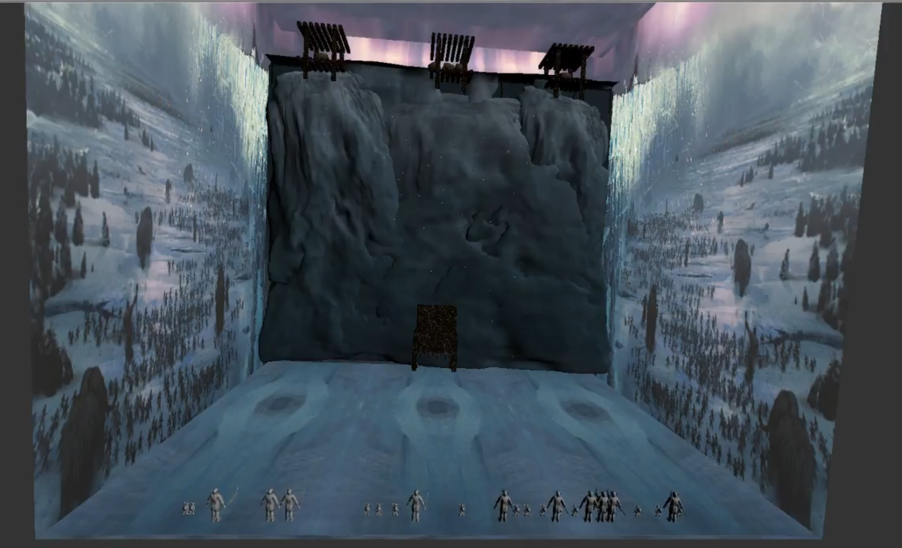
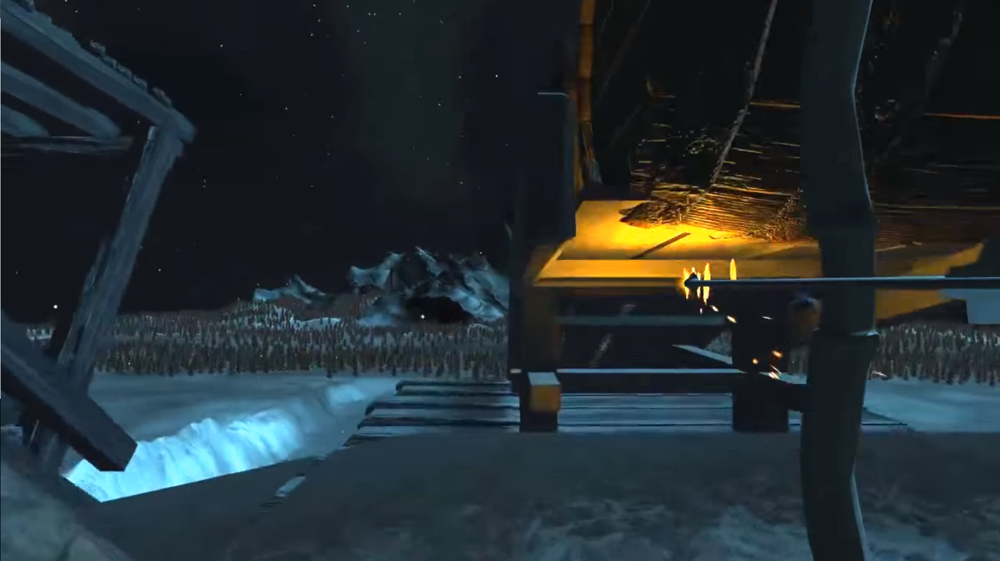

# Learning Unity: A 3D Wall Defence Game

A personal project learning the fundamentals and basics in Unity. Project is a 3D Wall Defence game that is a remake of my __Introduction to Interactive Digital Media__’s final project below.

### Original Project:

>   
> Video

Original project was developed in visual programming language, __MAX/MSP__, with little knowledge of game engines, scripting, and 3D modelling, hence the game is relatively simple. 

Topics on colliders and physics components were only briefly taught and project was given only 2 weeks to complete.

### Unity Remake:

>   
> Video

The remake, developed as a first-person shooter perspective, is a wall defence game where instead of just tumbling barrels, players can visually see their character shoot projectiles (arrows) as well as throwing barrels.

Game features:

- Basic Unity movement scripts to enable enemy AIs with climbing and running mechanics for players to interact with.
- Collision and event handling when specific units make contact via a trigger or collision.
- Arrow penetration implementation when objects are hit with an arrow (making the arrow stick to a target).
- UIs to indicate what objects are playable.
- Particle system to develop in-game effects for explosions and snow.
- Game design, level design, 3D modelling, and UV Mapping 

